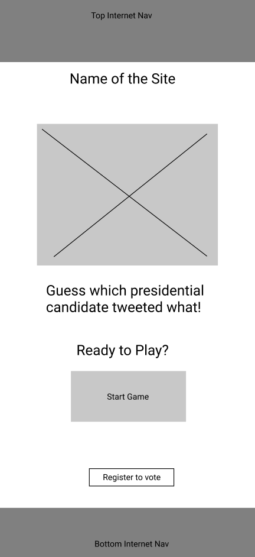
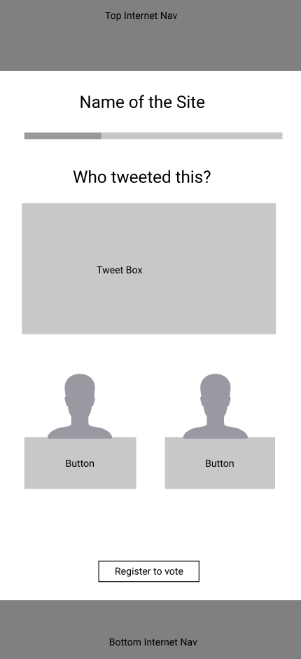
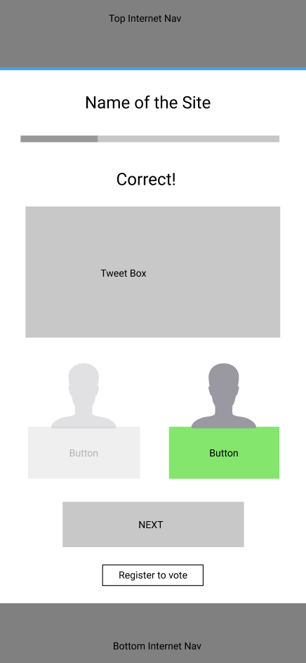
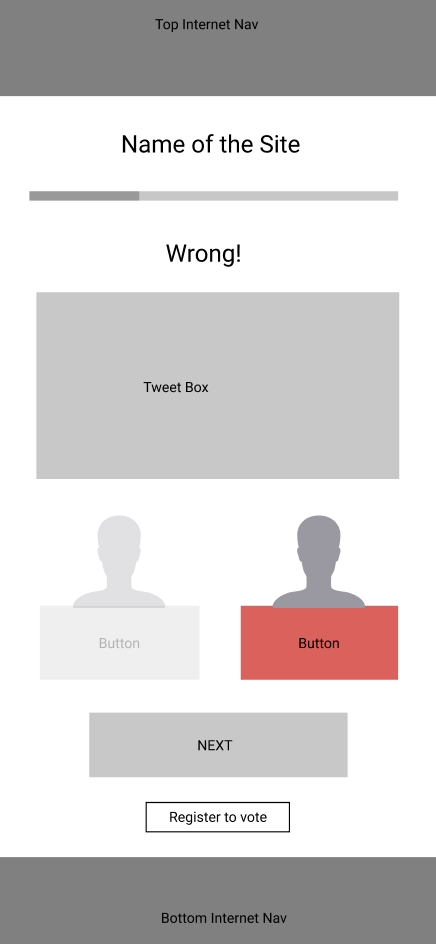
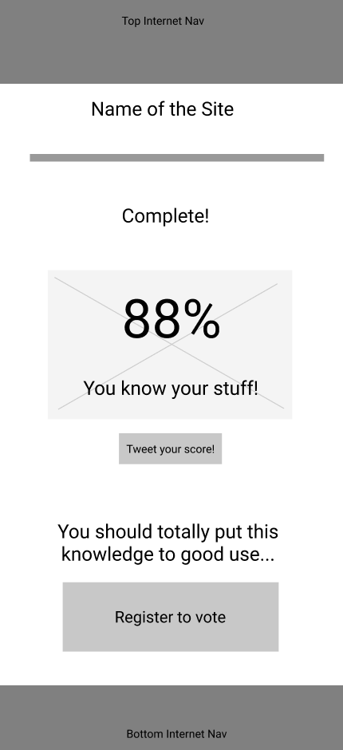

# tweet2020
https://tweets2020.netlify.app/

tweet2020 is an app designed to engage a younger generation of voters by utilizing social media to help give users an insight into the online persona of the four major candidates participating in the 2020 presidential election.

## User Story

Upon loading, the page displays graphics depicting characterized icons of the four 2020 presidential candidates (Joe Biden, Howie Hawking, Jo Jorgensen, and Donald Trump) as well as a "PLAY NOW" button that begins the game and a "Register to vote" button at the bottom of the screen that, when clicked, will redirect the user to vote.org where they may check their voter registration status and register if they have not already. This button is present on every screen.

Clicking the "Play Now" button brings the user to the question page where the user is presented with a tweet created by one of the four presidential candidates (with identifying informationredacted). The user is offered a choice between two of the four candidates to select as the original author of the tweet. 

Upon selecting their choice, the user is met with an "uncovered" tweet showing the identity of the author as well as a message at the top of the screen indicating whether they selected the correct or incorrect choice. Depending on if the selection is correct or incorrect, the selected option's button will change to either green or red respectively and a sound will follow to indicate if the choice is correct or not. A "NEXT" button appears upon answer selection which will take the user to the next question.

A progress bar at the top of the screen tracks what percentage of the total questions the user has answered. When the user has selected their choice for the final question, a "SEE MY SCORE" button will appear below the choices which will take the user to the results page.

The results page displays the user's score as a percentage of the questions they answered correctly as well as an option to tweet their score with a link to the app. The title, "tweet2020" at the top of the page also acts as a link back to the home page.

## Wireframes

### Home Page

### Question Page

### Correct Answer

### Incorrect Answer

### Results Page

## Technologies Used
- HTML5
- CSS3
- JavaScript
- React.js
- Deployed using netlify